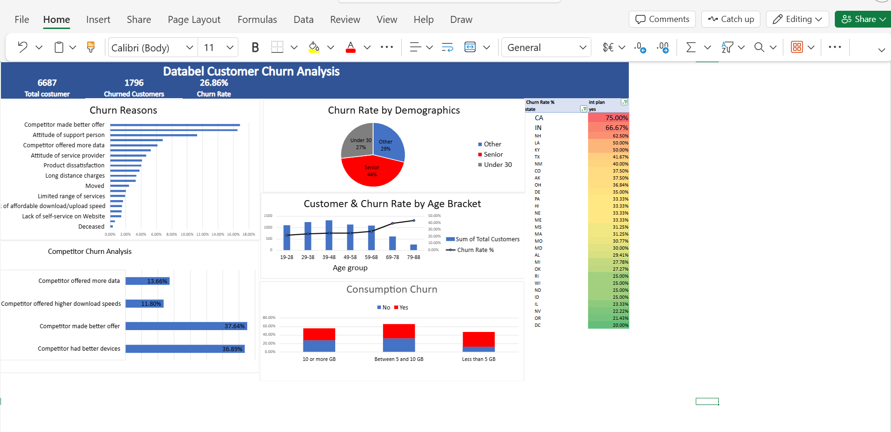

# 📊 Databel Customer Churn Analysis
 


 
## 📌 Project Overview
 
This project is a complete **customer churn analysis** for a fictitious telecom company called **Databel**, completed as part of the DataCamp Data Analyst certification track. The goal was to investigate **why customers are churning** and provide actionable insights through a fully interactive Excel dashboard.
 
---
 
## 🎯 Business Problem
 
> *"Why are customers leaving Databel, and what can be done to retain them?"*
 
Churn — the rate at which customers stop doing business with a company — is one of the most critical KPIs for any telecom provider. It is far more expensive to acquire new customers than to retain existing ones. This analysis identifies the key drivers of churn and highlights priority segments for retention efforts.
 
---
 
## 📁 Dataset
 
| Property | Detail |
|---|---|
| Source | DataCamp (fictitious Databel dataset) |
| Rows | 6,687 customers |
| Columns | 29 features |
| Format | Excel (.xlsx) |
| Time dimension | Snapshot (no time series) |
 
**Key columns used:**
- `Customer ID` — unique identifier
- `Churn Label` — Yes/No churn indicator
- `Churn Category` & `Churn Reason` — why customers left
- `Contract Type` — Month-to-Month, One Year, Two Year
- `Unlimited Data Plan` — Yes/No
- `Avg Monthly GB Download` — data consumption
- `Age`, `Senior`, `Under 30` — demographic fields
- `State`, `Intl Plan` — location and international plan
---
 
## 🔄 Data Analysis Workflow
 
```
Data Check → Exploratory Analysis → Analysis & Visualization → Dashboard → Insights
```
 
### 1️⃣ Data Check
- Verified **zero duplicate** Customer IDs using Conditional Formatting
- Identified missing values in `Churn Category` and `Churn Reason` — confirmed expected (non-churners have no reason)
- Validated 6,687 total rows with clean structure
### 2️⃣ Calculated Fields & New Columns
| New Column | Sheet | Logic |
|---|---|---|
| `Churned` | Customers | `=IF(Churn Label="Yes", 1, 0)` |
| `Demographics` | Aggregate | Nested IF → Under 30 / Senior / Other |
| `Grouped Consumption` | Aggregate | Nested IF → <5GB / 5-10GB / 10GB+ |
 
### 3️⃣ PivotTables Built
- Churn Rate by **Churn Reason** and **Churn Category**
- Churn Rate by **Demographics** and **Age Bracket**
- Churn Rate by **Unlimited Data Plan** and **Consumption Group**
- Churn Rate matrix by **State** and **International Plan**
- Churn Rate by **Account Length** and **Contract Type**
### 4️⃣ Dashboard
A single-page interactive Overview dashboard built entirely in Excel featuring:
- 3 KPI cards (Total Customers, Churned Customers, Churn Rate)
- 6 visualizations with consistent dark blue and orange branding
- Heat map table with Red-Yellow-Green conditional formatting
- Filtered views for Competitor churn and International Plan by State
---
 
## 📊 Key Findings
 
### 🔴 Overall Churn Rate: 26.86%
Roughly **1 in 4 customers** is leaving Databel — significantly above healthy industry benchmarks.
 
### 🏆 Top Churn Drivers
| Rank | Reason | % of Total Churn |
|---|---|---|
| 1 | Competitor made better offer | ~37.6% |
| 2 | Competitor had better devices | ~36.9% |
| 3 | Attitude of support person | high |
| 4 | Competitor offered more data | ~13.7% |
 
### 👥 Demographics Insight
| Group | Churn Rate |
|---|---|
| Under 30 | ~27% |
| Other | ~29% |
| **Senior** | **~44%** ⚠️ |
 
> Seniors churn at nearly **44%** — the highest of any demographic group.
 
### 📅 Age Bracket Insight
Churn rate increases consistently with age:
- 19-28 → **21.65%**
- 68-77 → **38.51%**
- 78-88 → **43.25%** ← highest
### 📱 Contract Type Insight
| Contract | Churn Risk |
|---|---|
| Month-to-Month | 🔴 Highest |
| One Year | 🟡 Medium |
| Two Year | 🟢 Lowest |
 
> The first 12 months are the **critical retention window** — churn drops significantly after year one.
 
### 🌐 International Plan Insight
Several states show alarmingly high churn rates among international plan customers:
- **California (CA):** 75.00% churn rate
- **Indiana (IN):** 66.67% churn rate
- **New Hampshire (NH):** 62.50% churn rate
---
 
## 💡 Business Recommendations
 
1. **Address competitor pricing** — "Competitor made better offer" is the #1 churn driver. Databel needs a competitive pricing review urgently.
2. **Retain senior customers** — Build dedicated support plans or senior-friendly pricing tiers to reduce the 44% senior churn rate.
3. **Focus on Month-to-Month customers in first 12 months** — Offer incentives to upgrade to annual contracts during the critical early window.
4. **Investigate international plan in CA, IN, NH** — These states have dangerously high churn among international plan customers.
5. **Review data plans** — Customers without unlimited plans using 5-10GB are churning due to unexpected extra charges.
---
 
## 🛠️ Tools & Skills Used
 
- **Microsoft Excel** — PivotTables, Calculated Fields, Nested IF formulas, Conditional Formatting, Combo Charts, Dashboard design
- **Data cleaning** — Duplicate detection, missing value handling
- **Data visualization** — Bar charts, Line charts, Doughnut charts, Combo charts, Heat maps
- **Statistical analysis** — Churn rate calculation, demographic segmentation, cohort analysis
---
 
## 📂 Project Structure
 
```
databel-churn-analysis/
│
├── README.md
├── Databel_Churn_Analysis.xlsx    ← Main workbook with all sheets
│   ├── Databel - Customer         ← Raw customer data
│   ├── Databel - Aggregate        ← Aggregated data with new columns
│   ├── Customer Pivots            ← Chapter 1 PivotTables & charts
│   ├── Churn Analysis             ← Chapter 2 PivotTables & charts
│   └── Overview                   ← Final dashboard
└── dashboard_screenshot.png       ← Dashboard preview image
```
 
---
 
## 🖼️ Dashboard Preview
 

 
---
 
## 👤 Author
 
**Wisdom Oghenevwede Uti**
- 🌐 Portfolio: [datascienceportfol.io/wisdomuti8]([https://datascienceportfol.io/wisdomuti8](https://www.datascienceportfol.io/wisdomuti8))
- 💼 LinkedIn: [linkedin.com/in/wisdomuti]((https://www.linkedin.com/in/uti-wisdom-286602228/))
- 🐙 GitHub: [github.com/wisdomuti8]((https://github.com/utiwisdom))
- 📧 wisdomuti8@gmail.com
---
 
## 📜 Certificate
 
Completed as part of the **DataCamp Data Analyst in Excel** certification track.
 
---
 
*⭐ If you found this project useful, please consider giving it a star!*
 
